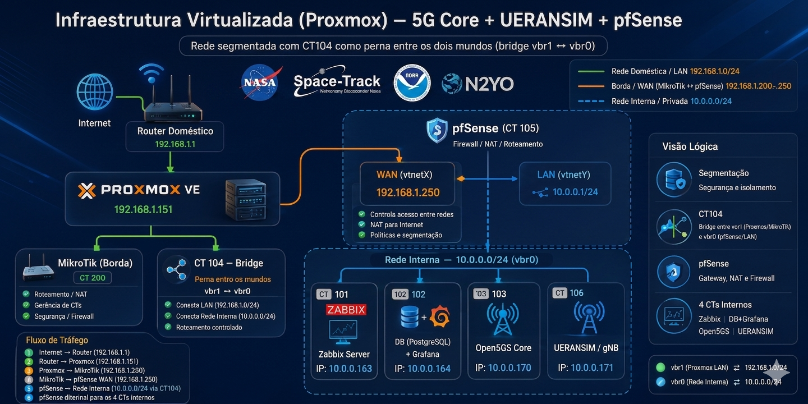

# 📡 Private 5G Standalone (SA) Core Network & Advanced Infrastructure Showcase

## 📝 Executive Overview
This repository serves as a public portfolio of technical and operational evidences demonstrating the successful deployment, orchestration, and validation of a private **5G Standalone (SA)** cellular network architecture. 

The entire ecosystem was designed and provisioned using enterprise-grade infrastructure concepts, utilizing lightweight virtualization via **Linux Containers (LXC)** over a **Proxmox VE** hypervisor. Perimeter security, network isolation, and routing optimization were strictly enforced through specialized virtual appliances (**pfSense & MikroTik**), simulating a real-world critical mission industrial network environment.

---

## 🏗️ High-Level Technical Pillars

### 1. Virtualized 5G Standalone Core
* **Core Network Stack:** Implemented using a 3GPP Release 16 compliant open-source cellular core framework (**Open5GS**).
* **Service Decoupling:** Full isolation of network functions in the control plane and user plane, including AMF (Access and Mobility Management Function) and UPF (User Plane Function) daemons running as native system services.

### 2. RAN Simulation & Control/User Plane Handshake
* **Emulated Infrastructure:** Orchestrated via advanced emulation layers (**UERANSIM**) simulating Next-Generation NodeB (gNB) radio stations and User Equipment (UE).
* **Signaling Protocols:** Validation of secure SCTP associations over port `36412` (NGAP layer) and robust GTP-U encapsulation tunnels for subscribers' data plane traffic.

### 3. Unified Telemetry & Observability Layer
* **Metrics Harvesting:** Live monitoring integration utilizing enterprise collectors (**Zabbix / Prometheus Exporters**).
* **Data Visualization:** Production-ready dashboards hosted in **Grafana**, mapping hardware resource constraints, network throughput, and packet-forwarding metrics simultaneously.

---

## 🎬 Operational Evidences & Live Validations

The sections below contain verified, unedited captures of the environment in full production state, validating the architectural stability, orchestration workflow, and routing.

### 🌐 Unified Infrastructure Topology (Validated with Real-time Telemetry)
Below is the validated technical blueprint used to orchestrate this standalone private network. This topology maps the exact container IDs (CT) and internal IPs verified side-by-side with our infrastructure logs:

### 🖥️ Proxmox VE Boot Sequence & E2E Core 5G SA Operation Showcase
The complete, unedited operation video tracking the entire lifecycle of the environment—starting from the hypervisor layer, passing through pfSense/MikroTik routing, up to the cellular communication links—is hosted securely via the link below:

🔗 [**Click Here to Watch the Full Verification Video on Streamable**](https://streamable.com/h73uz5)

* **00:00 - Boot & Hypervisor Layer:** Initial Proxmox VE node startup sequence (`pve-cesar`), initializing memory mappings and bringing up software-defined virtual bridges (`vmbr0` / `vmbr1`).
* **Micro-services & Network Appliances Initialization:** Core virtual routing and perimeter security startup inside **pfSense (CT 100)** and border management alignment via **MikroTik RouterOS / Winbox (CT 200)**.
* **5G SA Core & RAN Emulation:** Native systemd daemon verification inside **Open5GS Core (CT 103)** and successful **SCTP association (Port 36412)** setup with **UERANSIM / gNB (CT 106)**.
* **Live Traffic Routing & Telemetry:** Subscriber profile attach validation leading to active User Equipment (UE) successfully routing live internet traffic through the virtualized UPF data plane, monitored side-by-side on custom Zabbix (`10.0.0.163`) and Grafana (`10.0.0.164`) dashboards.

---

## 🗂️ Micro-Service Architecture & Containerization Breakdown (CT by CT)

The ecosystem is logically segmented into specialized, low-overhead Linux Containers (LXC), separating control, security, transport, and management planes.

### 🛡️ CT 100 — pfSense (Network Core Perimeter & Security Gateway)
* **Role:** Next-Generation Firewall (NGFW), NAT Gateway, and Local Domain Router.
* **Interfaces:** Dual-homed routing tying the external host environment (`vtnetX` / `vmbr1` WAN) directly to the isolated 5G environment (`vtnetY` / `vmbr0` LAN).
* **Operational Essence:** Enforces strict stateful packet inspection, isolated subnet routing tables, and dynamic port forwarding. It acts as the ultimate checkpoint, allowing the emulated cellular UEs inside the internal subnet to access public internet resources safely while shielding the core layers from unauthorized host-level traffic.

### 📊 CT 101 — Zabbix Server (Infrastructure Observability Engine)
* **IP Address:** `10.0.0.163`
* **Role:** Enterprise-grade distributed monitoring and active SNMP/Agent collection.
* **Operational Essence:** Tracks real-time health metrics across the virtualized hypervisor. Configured with automated triggers for CPU spikes, memory starvation, and network bridge anomalies. It ensures the physical and virtualized host blocks are running well within operational parameters to guarantee zero-packet-drop handovers.

### 📉 CT 102 — Database & Grafana (Advanced Metrics Visualization Data-Plane)
* **IP Address:** `10.0.0.164`
* **Role:** Unified analytics, multi-tenant dashboards, and timeseries data storage (`PostgreSQL`).
* **Operational Essence:** Converts raw performance indicators harvested by the collectors into comprehensive high-level observability telemetry. Provides customized dashboards mapping network jitter, bridge throughput, container latency profiles, and resource consumption bottlenecks side-by-side.

### 🧠 CT 103 — Open5GS (3GPP Release 16 Standalone 5G Core Network)
* **IP Address:** `10.0.0.170`
* **Role:** Centralized 5G Evolved Packet Core & Next-Generation Core Data Plane (UPF/CP).
* **Operational Essence:** Runs native, decoupled system daemons mapping the essential 5G Network Functions (NFs). The Control Plane (AMF, SMF, AUSF, UDM) manages high-speed cryptographic subscriber profiles, authentication, and mobility states, while the ultra-lightweight User Plane Function (UPF) handles high-throughput encapsulation and routing directly at the kernel interface level.

### 📡 CT 106 — UERANSIM (Next-Generation RAN & UE End-to-End Emulator)
* **IP Address:** `10.0.0.171`
* **Role:** 5G New Radio (NR) gNodeB Station and User Equipment Data-Plane Simulation.
* **Operational Essence:** Emulates the complete 5G radio access network layer. It initiates native Stream Control Transmission Protocol (SCTP) connections to bind onto the AMF control plane over port `36412` (NGAP standard), creates virtual `tun` interfaces representing cellular devices, and wraps user data inside GTP-U tunnels to validate true end-to-end user-plane throughput across the core.

---

## ⚠️ PROPRIETARY NOTICE & SCIENTIFIC EMBARGO

> **[INTELLECTUAL PROPERTY PROTECTION]**
> The structural blueprints, detailed network topology maps, customized routing matrices, pfSense/MikroTik rule sets, deployment YAML files, and automation source codes associated with this laboratory are currently under a strict **Scientific Embargo**.  
> 
> This laboratory acts as the experimental foundation for an **original, autoral technical-scientific research paper** submitted for peer-review at a prestigious symposium. In compliance with academic originality and copyright policies, the underlying source codes and step-by-step deployment blueprints are hidden from public view and will be officially released under an open-source license **ONLY** after the official publication and homologation of the scientific paper.  
> 
> **© César Ueler | Lab Home Infrastructure - Todos os Direitos Reservados.**
